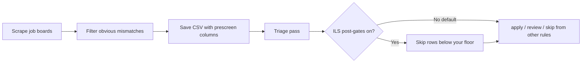

# ILS matrix — scoring settings explained

## In one sentence

**ILS (Interview Likelihood Score)** is a number from about 18 to 72 that answers: *“Based on what this job posting says, how promising does it look for getting an interview?”*

It is a **sorting aid for your own list**, not a guarantee and not legal or hiring advice.

---

## What is the matrix file?

Think of `config/ils_matrix.yaml` as a **settings sheet** — like the rules behind a spreadsheet formula. It does not store your personal info. It stores **how points add up** when the tool reads a job description (JD):

- Which tool names in the posting earn points (D1)
- How “years of experience” wording changes the score (D2)
- Red flags that lower the score (staffing agencies, heavy travel, etc.)
- A travel penalty table (higher stated travel → more points subtracted)
- Minimum and maximum score caps

You copy the template once during onboarding. You can ignore it for weeks and still run scrapes and triage. Tuning it is optional and comes **after** you are comfortable with your profile and first CSV results.

**Analogy:** Your profile (`config/profile.yaml`) is *your* address, pay floor, and skills list. The ILS matrix is the *rubric* the computer uses to grade each posting against that kind of role.

---

## How a job moves through the pipeline

Optional ILS gating happens only at the **triage** step — never during the initial scrape.



Plain-English version:

```
scrape boards  →  drop wrong geo / pay / blocklist  →  CSV file
                                                      ↓
                                            triage (second pass)
                                                      ↓
                              optional: skip if score below your floor
```

Even when ILS gating is **off**, triage still adds an `ils_estimate` column so you can sort and learn — it just does not auto-skip rows for a low score.

---

## The five dimensions (D1–D5)

The tool adds points from five buckets, subtracts travel (and sometimes a contract penalty), then clamps the total between a min and max. Below: what each bucket means, with **example wording** from real-style postings.

### D1 — Stack match (“Do they want tools I have?”)

**Plain English:** The posting mentions technologies from your matrix tool list. More hits → more points, up to a cap (default **25**).

| Example wording in the JD | Effect |
|---------------------------|--------|
| “Experience with **Playwright**, **Python**, and **pytest**” | Adds points for each tool found (default **+2** per hit on top of a **+5** base) |
| “QA generalist — no specific stack listed” | Few or zero D1 points |
| Tools listed that are **not** in your matrix | No extra points for those (tune `dimensions.d1_stack_match.tools` to match **your** stack) |

**Tune when:** You keep seeing good roles score low because your main tools are missing from the matrix list.

---

### D2 — Experience (“Are they asking for more years than I have?”)

**Plain English:** The title and early JD text are scanned for years-of-experience phrases. Higher year bars → fewer D2 points. A PhD or master’s **required** line can subtract a small penalty.

| Example wording | Effect |
|-----------------|--------|
| “**5–7 years** of test automation experience” | Maps to a friendlier tier → **more** D2 points (default up to **16** in that band) |
| “**12+ years** required” | Maps to a stricter tier → **fewer** D2 points (default **9** in that band) |
| “**PhD required**” in the JD | Small penalty (default **−3**) |

**Tune when:** You are mid-career and “10+ years” postings dominate your skip pile — adjust `year_tiers` under `d2_experience`.

---

### D3 — Domain bridge (“Is this employer/posting type a fit?”)

**Plain English:** Starts at a default score, then adjusts for employer type and JD framing — staffing firms, nuclear-industry keywords, gig-style labeling, etc.

| Example | Effect |
|---------|--------|
| Company name contains “**Staffing**” or “**Nearshore**” | Points **subtracted** (company penalty) |
| JD says “**staffing agency**” or “**body shop**” in the opening | Additional **subtraction** |
| JD mentions “**nuclear**” / “**AP1000**” | D3 **capped lower** (specialized domain) |
| “**Train AI models**” / “**label data**” gig phrasing | Penalty — often not a traditional QA role |
| Normal product company, standard QA JD | Keeps closer to the default (**12** before cap **20**) |

**Tune when:** You want to be stricter or looser on contract/staffing employers — edit keyword lists under `d3_domain_bridge`.

---

### D4 — Application method (baseline)

**Plain English:** In the automated formula, every row gets the same small fixed chunk (default **7**). The bundle does **not** read “apply via LinkedIn vs employee referral” from the JD for D4 — that nuance is for **manual research** and optional company override JSON.

| Example | Effect |
|---------|--------|
| Any posting (JD fallback) | Fixed **+7** unless you add a researched override for that employer |

---

### D5 — Portfolio (baseline)

**Plain English:** Same idea as D4 — a fixed placeholder (default **+7**) in the JD formula. Portfolio strength from your own research goes in **company overrides**, not in this automated pass.

---

### Travel penalty (“How much road time do they want?”)

**Plain English:** If the JD states a travel percentage, points are **subtracted**. No travel language → **0** penalty.

| Stated travel in the JD | Points subtracted (defaults) |
|-------------------------|------------------------------|
| None mentioned | **0** |
| About **11–19%** | **7** |
| About **20–29%** | **12** |
| About **30–39%** | **20** |
| About **40–49%** | **22** |
| **50%** or more | **28** |

**Example JD line:** “Position requires **25% travel** to client sites” → travel band applies → score drops by **12** before the final clamp.

**Other subtraction:** “**Contract**” in the early JD without “**W2**” nearby → small extra penalty (default **−4**).

**Final clamp:** Raw total is kept between **18** and **72** (defaults in `fallback.score_min` / `score_max`).

---

## How `config/profile.yaml` sets your “pass line”

The matrix computes **`ils_estimate`** per row. Your profile sets **how high that number must be** to avoid an auto-skip when ILS post-gates are on.

| Profile setting | What it means | Numeric example (defaults) |
|-----------------|---------------|----------------------------|
| `ils.cold_floor` | Baseline pass line for companies with **no** referral entry | **45** — estimate must be ≥ 45 to pass (when triage uses the same floor) |
| `referrals.status_file` | Lists employers where you have a **warm** or **strong** path | See table below |
| `ils.referral_warm_delta` | Lowers the pass line for **warm** referrals | **−10** → effective floor **35** (45 + (−10)) |
| `ils.referral_strong_delta` | Lowers the pass line for **strong** referrals | **−20** → effective floor **25** (45 + (−20)) |

### Referral file format

File path: `applications/referral_status.txt` (or whatever you set under `referrals.status_file`).

One company per line: `company_substring,warm` or `company_substring,strong`. Lines starting with `#` are comments.

```
# company_substring,status
acme corp,warm
bigco inc,strong
```

Matching is **substring** on the company name column (“Acme Corp (via Indeed)” still matches `acme corp`).

| Referral tier | Meaning | Effective floor when `cold_floor: 45` |
|---------------|---------|----------------------------------------|
| **cold** | Not listed | **45** |
| **warm** | Connection or light path | **35** |
| **strong** | Someone who can refer you | **25** |

Deltas are **negative on purpose** — a warm intro lets a slightly lower automated score still pass.

### Worked example

- Posting A: `ils_estimate` = **42**, company is **cold** → below floor **45** → **skip** (when post-gates on).
- Posting B: same score **42**, company is **warm** → floor **35** → **not skipped for ILS**.
- You lower `cold_floor` to **40** and run triage with `--ils-floor 40` → Posting A would pass the ILS gate.

Keep `cold_floor` and the `--ils-floor` flag **aligned** when you change either.

Optional researched scores (after you read careers pages, talk to people, etc.) live in `config/company_ils_overrides.json` — those **replace** the formula for matching companies. See [reference-ils-scoring-model.md](reference-ils-scoring-model.md).

---

## If you never touch ILS

| Situation | What happens |
|-----------|--------------|
| You only run onboarding | Templates are copied; defaults work out of the box |
| First triage runs | Use **`--no-post-gates`** (recommended while learning) — no auto-skip for ILS or arrangement post-gates; `ils_estimate` column still appears for sorting |
| You never edit `ils_matrix.yaml` | Bundled example matrix is used; you may see a one-line note suggesting you copy it to customize |
| You never edit `ils` in profile | Floors stay at defaults: cold **45**, warm **35**, strong **25** |
| You never add company overrides | Every row uses the JD formula only |

**You do not need to tune ILS before your first scrape.** Get profile, metro, and comp right first — see [your-profile.md](your-profile.md).

---

## When you are ready to turn scoring gates on

| Mode | What it does |
|------|----------------|
| **Pipeline only (good default)** | `python3 scripts/triage_jobspy_csv.py --latest --no-post-gates` — verdicts from geo, comp, blocklist, etc.; ILS shown but not used to skip |
| **With ILS floor** | `python3 scripts/triage_jobspy_csv.py --latest --ils-floor 45` — also skips rows under the effective floor (referral-adjusted) |

`--no-post-gates` turns off **both** arrangement post-gates and the ILS floor skip.

---

## Tuning checklist (optional, later)

1. Copy `config/ils_matrix.example.yaml` → `config/ils_matrix.yaml` if you have not already (onboarding usually does this).
2. Edit `dimensions.d1_stack_match.tools` to mirror **your** résumé stack.
3. Adjust D2 `year_tiers` if experience wording feels miscalibrated.
4. Add `company_ils_overrides.json` entries only after **you** have a researched score — not from guesswork.

---

## What this is not

- A full manual research session (referral paths, culture, structural caps) — that stays outside this bundle.
- A hire probability or happiness score.
- Applied during the first scrape — only optional at triage.

Every automated score is **deliberately conservative**. Expect under-scoring on great fits with thin JDs and over-scoring on buzzword-heavy posts. Use floors and overrides after you have triaged a real batch.

---

## Related docs

- [Your profile](your-profile.md) — metro, comp, and `ils` / `referrals` fields
- [ILS scoring reference](reference-ils-scoring-model.md) — override kinds and code paths (more technical)
- [README](../README.md) — start here and troubleshooting
